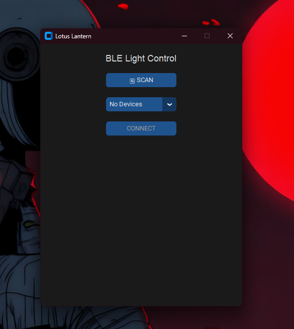
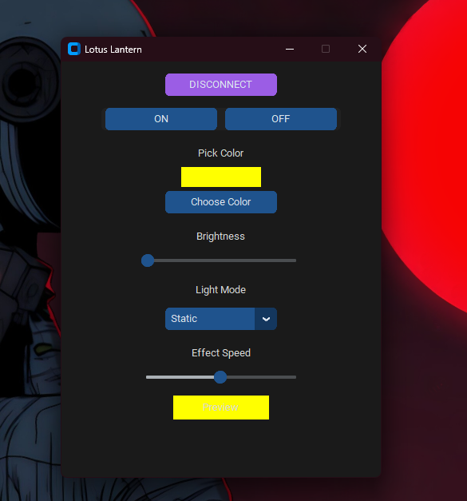

# 🌸 Lotus Lantern - BLE LED Controller

**Lotus Lantern** is a simple, modern desktop application to control BLE-enabled RGB LED lights.  
Built using Python, `customtkinter`, and `bleak`, it supports power control, color picking, brightness adjustment, lighting effects, and effect speed — all in a sleek dark-mode GUI.

> 🔌 Ideal for DIY LED strips, BLE light bulbs, or any device that uses GATT-based LED control.

---

## 🚀 Features

- ✅ Auto-scan and connect to BLE devices
- 🎨 RGB color selection
- 💡 Brightness control (0–255)
- 🌈 Multiple light modes: Static, Fade, Blink, Rainbow, Strobe, Wave
- ⏩ Effect speed control
- 💾 Remembers your last settings
- 🖼 Modern dark-themed interface (CustomTkinter)
- 📦 Lightweight, no bloat

---

## 🖥️ Screenshots

*(Include screenshots in your repo and reference them here)*  
```md


